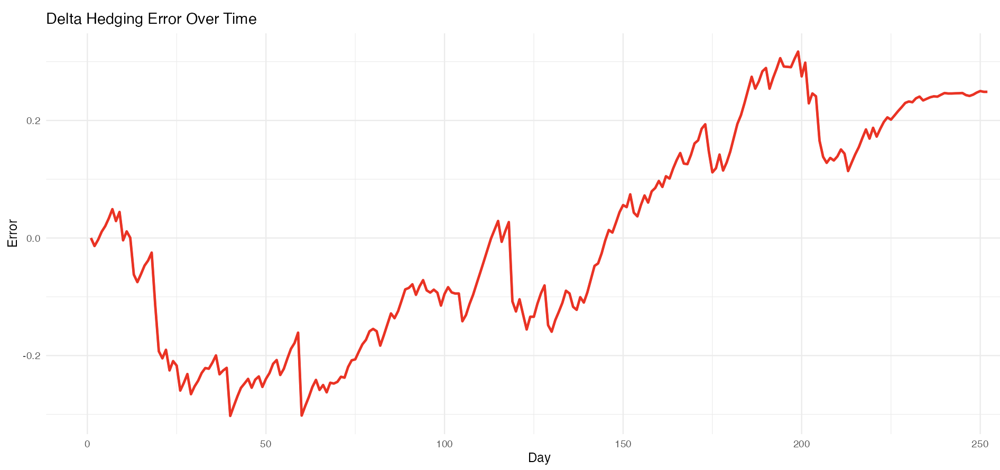
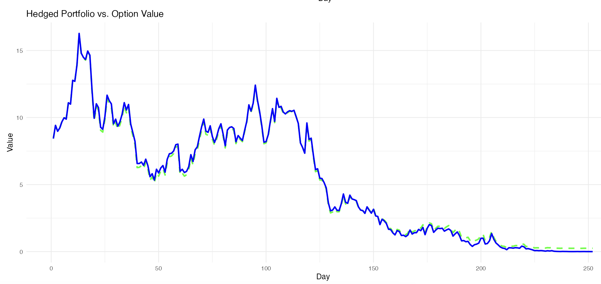
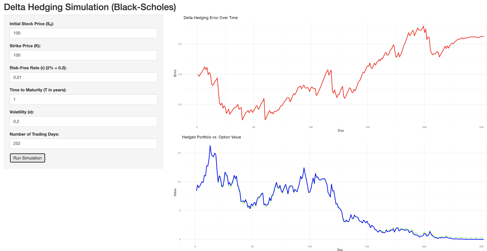

# Delta Hedging Simulator in R Shiny

[](LICENSE)
[](https://www.r-project.org/)
[](https://shiny.rstudio.com/)
[](https://en.wikipedia.org/wiki/Black%E2%80%93Scholes_model)


This is an interactive application that simulates a delta-hedged portfolio for a European call option using the Black-Scholes model. Built with R and Shiny, the project brings core financial engineering concepts to life through simulation and visualization.

---

## Features

- Accepts user inputs for: initial stock price, strike price, interest rate, time to maturity, volatility, and number of trading days
- Simulates a stock price path using geometric Brownian motion
- Prices the European call option using the Black-Scholes model
- Recalculates delta daily and dynamically rebalances the portfolio
- Visualizes:
  - Hedging error over time
  - Portfolio value versus theoretical option value

---

## How to Run

### 1. Install required packages

```r
install.packages("shiny")
install.packages("ggplot2")
```

### 2. Run the app in RStudio

```r
shiny::runApp("app.R")
```

---

## Screenshots

### 1. Hedging Error Over Time

This plot shows the error between the simulated delta-hedged portfolio and the theoretical option price over time.



### 2. Portfolio Value vs Option Price

This chart shows the comparison between the value of the simulated portfolio and the theoretical value of the option using Black-Scholes.



### 3. Shiny App Interface

A full view of the Shiny app where the user interacts with parameters and visualizes the results in real time.



---

## How It Works

1. Simulates a stock price path using geometric Brownian motion
2. Prices the call option daily with the Black-Scholes model
3. Constructs a delta-neutral portfolio each day:
   - Long delta shares
   - Short one option
   - Remaining cash earns interest
4. Rebalances the hedge daily
5. Visualizes the difference between the theoretical option price and the portfolio value

---

## About This Project

Developed by Nicolás Sánchez, an economics student at IE University, this project was created to apply quantitative finance concepts covered in the "Financial Derivatives: A Quantitative Finance View" Udemy course.

The project demonstrates the integration of:

- Financial modeling
- Programming in R
- Simulation and data visualization
- Derivatives and portfolio hedging theory

---

## Key Concepts

- Black-Scholes pricing for European call options
- Delta hedging and rebalancing
- Risk-neutral valuation
- Geometric Brownian motion
- Interactive finance simulations using Shiny

---

## License

This project is licensed under the MIT License. See the [LICENSE](LICENSE) file for full details.
